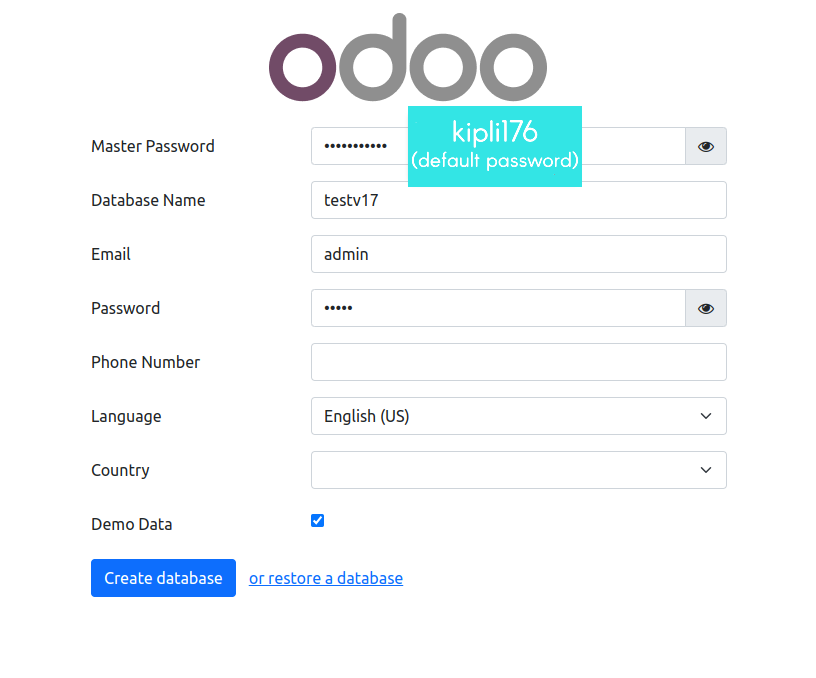
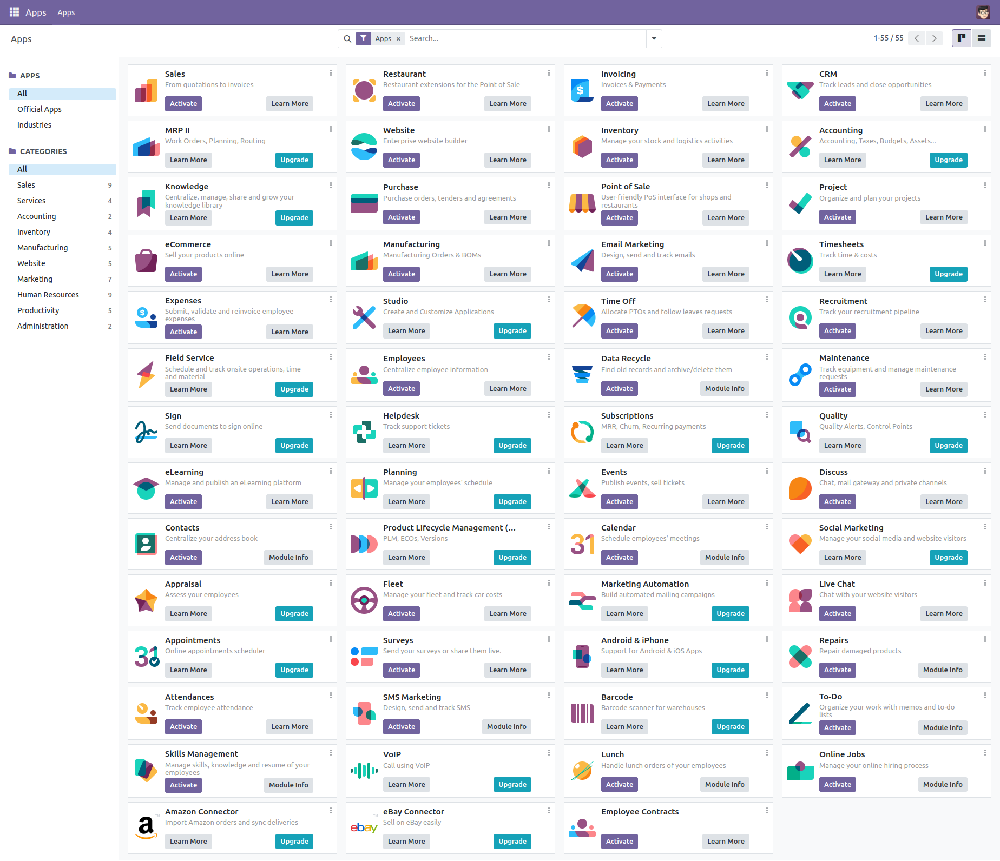
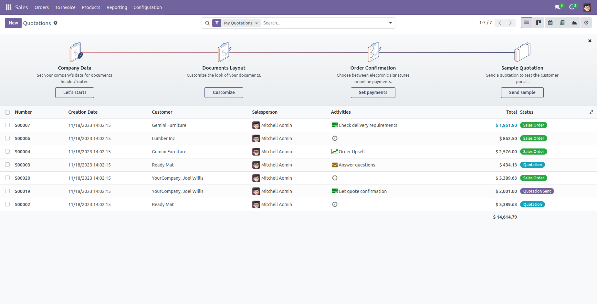

# Menginstal Odoo 17.0 dengan satu perintah (Mendukung beberapa instance Odoo di satu server).

## Instalasi

Instal [docker](https://docs.docker.com/get-docker/) dan [docker-compose](https://docs.docker.com/compose/install/) dulu, lalu jalankan yang berikut ini untuk menyiapkan instans Odoo pertama @ `localhost:10017` (kata sandi master default: `kipli176`):


``` bash
curl -s https://raw.githubusercontent.com/kipli176/odoo-17-docker-compose/main/run.sh | sudo bash -s odoo-satu 10017 20017
```
dan/atau menjalankan hal berikut untuk menyiapkan instance Odoo lainnya @ `localhost:11017` (kata sandi utama default: `kipli176`):

``` bash
curl -s https://raw.githubusercontent.com/kipli176/odoo-17-docker-compose/main/run.sh | sudo bash -s odoo-dua 11017 21017
```

Beberapa argumen:
* Argumen pertama (**odoo-satu**): Folder penerapan Odoo
* Argumen kedua (**10017**): Port Odoo
* Argumen ketiga (**20017**): port live chat

Jika `curl` tidak ditemukan, pasanglah: 

``` bash
$ sudo apt-get install curl
# or
$ sudo yum install curl
```

## Usage

Start kontainer:
``` sh
docker-compose up
```
Kemudian buka `localhost:10017` untuk mengakses Odoo 17.

- **Jika mendapatkan masalah izin**, ubah izin folder untuk memastikan bahwa kontainer dapat mengakses direktori:

``` sh
$ sudo chmod -R 777 addons
$ sudo chmod -R 777 etc
$ sudo chmod -R 777 postgresql
```

- Jika ingin memulai server dengan port yang berbeda, ubah **10017** menjadi nilai lain di **docker-compose.yml** di dalam direktori induk:

```
ports:
 - "10017:8069"
```

- Untuk menjalankan kontainer Odoo dalam mode terpisah (dapat menutup terminal tanpa menghentikan Odoo):

```
docker-compose up -d
```

- Untuk Menggunakan kebijakan restart, yaitu mengonfigurasi kebijakan restart untuk kontainer, ubah nilai yang terkait dengan kunci **restart** di berkas **docker-compose.yml** ke salah satu dari berikut ini: 
   - `no` =	 Jangan memulai ulang wadah secara otomatis. (default)
   - `on-failure[:max-retries]` =	Mulai ulang kontainer jika kontainer keluar karena kesalahan, yang bermanifestasi sebagai kode keluar yang bukan nol. Secara opsional, batasi berapa kali daemon Docker mencoba memulai ulang kontainer dengan menggunakan opsi :max-retries.
  - `always` =	Selalu mulai ulang kontainer jika berhenti. Jika dihentikan secara manual, kontainer akan dimulai ulang hanya jika daemon Docker dimulai ulang atau kontainer itu sendiri dimulai ulang secara manual. (Lihat poin kedua yang tercantum dalam detail kebijakan memulai ulang)
  - `unless-stopped`	= Mirip seperti biasanya, kecuali ketika kontainer dihentikan (secara manual atau lainnya), kontainer tidak dimulai ulang bahkan setelah daemon Docker dimulai ulang.
```
 restart: always             # dijalankan sebagai service
```

- Untuk meningkatkan jumlah maksimum file yang di read dari 8192 (default) menjadi **524288**. Untuk menghindari kesalahan saat kami menjalankan beberapa instance Odoo. Ini adalah *langkah opsional*. Perintah ini untuk pengguna Ubuntu: 

```
$ if grep -qF "fs.inotify.max_user_watches" /etc/sysctl.conf; then echo $(grep -F "fs.inotify.max_user_watches" /etc/sysctl.conf); else echo "fs.inotify.max_user_watches = 524288" | sudo tee -a /etc/sysctl.conf; fi
$ sudo sysctl -p    # apply konfigurasi baru
``` 

## Custom addons

Folder **addons/** berisi addons khusus. Letakkan saja add-on khusus jika ada.

## Odoo configuration & log

* Untuk mengubah konfigurasi Odoo, edit file: **etc/odoo.conf**.
* Log file: **etc/odoo-server.log**
* Default database password (**admin_passwd**) is `kipli176`, ubah @ [etc/odoo.conf#L60](/etc/odoo.conf#L60)

## Manajemen kontainer Odoo

**Run Odoo**:

``` bash
docker-compose up -d
```

**Restart Odoo**:

``` bash
docker-compose restart
```

**Stop Odoo**:

``` bash
docker-compose down
```

## Live chat

Di dalam [docker-compose.yml#L21](docker-compose.yml#L21), mengekspos port **20017** untuk live-chat di host.

Mengonfigurasi **nginx** untuk mengaktifkan fiturlive-chat (in production):

``` conf
#...
server {
    #...
    location / {
        proxy_redirect off;
        proxy_pass http://0.0.0.0:10017;
    }
    location /longpolling/ {
        proxy_pass http://0.0.0.0:20017/longpolling/;
    }
    location ~* /web/static/ {
        proxy_cache_valid 200 90m;
        proxy_buffering    on;
        expires 864000;
        proxy_pass http://0.0.0.0:10017;
    }
    #...
}
#...
```

## docker-compose.yml

* odoo:17
* postgres:16

## Tangkapan layar Odoo 17.0 setelah instalasi berhasil.








